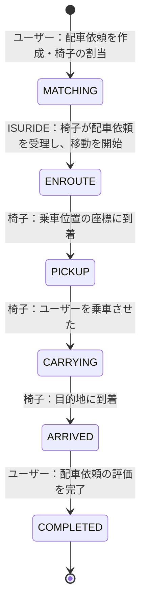

# ISURIDE アプリケーションマニュアル

<!-- TODO（公開前）: リンクの張り替え -->

[ISUCON14 当日マニュアル](./manual.md)も合わせて確認してください。

## ISURIDEとは

「電車での移動は大変…」「自家用車は駐車場代が高い…」そんなあなたにおすすめな全く新しいライドチェアサービスがISURIDEです。

ISURIDEはアプリで呼んだ椅子に座り、自動運転で目的地まで移動できるサービスです。
昨今、持続可能な社会を目指すためシェアリングへコノミーへの注目が高まっています。
また、自動運転という新たなビジネスモデルは交通事故の削減や、交通渋滞の緩和なども期待されています。

ISURIDEでは、チェアオーナーが提供する椅子をユーザーがアプリから配車リクエスト、目的地を入力しマッチングするとすぐに椅子が到着します。

利用後のドライビング評価システムを活用し、ユーザー・チェアオーナーともに満足度の高いライドチェアサービスを実現していきます。

利用エリアも続々拡大中！
オトクな招待キャンペーンも実施中！
今なら新規登録でますますお得に！

## 用語

### 地域（region）

- ISURIDEがサービスされている架空の世界に存在する地域（チェアタウン・コシカケシティ）です。
- 地域およびその郊外を含めて、碁盤の目のように区画され道が整備されています。

### ユーザー（user）

- ISURIDEアプリを利用して実際に移動する人です。
- ユーザーは在住している地域内での移動を目的としてISURIDEを利用します。

### 椅子（chair）

- ユーザーを載せて移動する自律運転式の椅子です。
- 椅子はISURIDEアプリを通じてユーザーに配車されます。
- 椅子には移動速度の異なるモデルが複数存在します。ユーザーの待機時間や全体としての流動性を考慮して割り当てを行うことが望ましいです。
- 椅子は自律運転で移動しますが、必ずしも最短の経路で移動するわけではありません。
- 椅子は正しく位置履歴を記録するため、位置情報を更新するリクエストが成功したことを確認するまで次の移動を行いません。

### オーナー（owner）

- ISURIDEで椅子を運用している企業・個人です。
- 椅子を運用することで収益を上げることを目的としています。
- オーナーは定期的に自分の管理している椅子の収益を確認し、十分に収益を上げられていることを確認すると更なる椅子の導入を検討します。

### 配車依頼（ride）

- ユーザーがISURIDEアプリを通じて椅子を呼び出し、椅子に乗り移動後、評価を行うまでの一連の流れのことを指します。
- ユーザーは自分が行った配車依頼が　`COMPLETED` になるまで他の配車依頼を行うことができません。
- 椅子は自分に割り当てられた配車依頼が `COMPLETED` になるまで他の配車依頼を受けることができません。
- `COMPLETED` に遷移する際、ユーザーはそのrideに対して評価を行います。
  - この評価はユーザーの口コミに影響を与えるため、高い評価はユーザー数の増加に繋がります。
  - 評価には以下のような項目が関係していることが知られています。
    - 配車を依頼してから実際に椅子が割り当てられるまでの時間
    - 割り当てられた椅子が乗車位置に早く到着しそうかどうか（乗車位置に近い椅子が割り当てられていたり、遠くても速い椅子が割り当てられている場合が好ましい）
    - 椅子が割り当てられてから、ユーザーが乗車できるまでの時間
    - ユーザーが乗車してから目的地に到着するまでの時間

配車依頼は、 `MATCHING`, `ENROUTE`, `PICKUP`, `CARRYING`, `ARRIVED`, `COMPLETED` の6つの状態を持ちます。

それぞれの状態は以下のように遷移します。

## 通知エンドポイント

ISURIDEではクライアントに配車状態の変化を通知するための2つのエンドポイントが実装されています。

- ユーザー向け通知：　`/api/app/notification`
- 椅子向け通知：　`/api/chair/notification`

これらは参考実装では通常のJSONレスポンスを返すエンドポイントですが、SSE(Server-Sent Events)を利用してリアルタイム通知を実装することも可能です。

### JSONレスポンス

- サーバーがJSONレスポンスを返す場合、クライアントはポーリングによって配車状態の変化を取得します。
- Content-Typeは `application/json` です。
- クライアントはレスポンスの `retry_after_ms` で指定された時間後に再度リクエストを送信します。
  - 初期実装では30ms後に再度リクエストを送信するようになっています。

### SSE(Server-Sent Events)

- サーバーがSSEを利用してリアルタイム通知を行う場合、クライアントはSSEストリームから配車状態の変化を取得します。
- Content-Typeは `text/event-stream` です。
- 通知メッセージは以下のようになります。
  - `data: {JSONデータ}`
- サーバーは接続後即座に接続してきたユーザーまたは椅子に割り当てられた最新の配車状態を送信する必要があります。
- その後は随時最新の配車状態を送信します。
  - 状態が変わった時のみ即座に送信することが望ましいです。

### 通知の順序

どちらの通知もクライアントに対しては発生したすべての状態を発生した順序通りに返す必要があります。

例えばユーザーが配車依頼Aを作成し椅子が割り当てられ椅子が乗車位置に到着したあと初めて通知エンドポイントにリクエストした場合を考えます。
この時、配車依頼Aは`MATCHING` → `ENROUTE` → `PICKUP` の順で状態が遷移しているため、クライアントには

- １回目：配車依頼A:`MATCHING`
- ２回目：配車依頼A:`ENROUTE`
- ３回目：配車依頼A:`PICKUP`
  の順で通知を返す必要があります。

同様に配車依頼Aで目的地に到着し、評価を行った後に配車依頼Bを作成したあと通知エンドポイントにリクエストした場合、クライアントには

- １回目：配車依頼A:`ARRIVED`
- ２回目：配車依頼A:`COMPLETED`
- ３回目：配車依頼B:`MATCHING`
- ４回目：配車依頼B:`ENROUTE`
  の順で通知を返す必要があります。

## 配車依頼のマッチング

参考実装では `isuride-matcher` というsystemdサービスが `GET /api/internal/matching` を500msごとにポーリングすることで配車依頼と椅子のマッチングを行っています。
以下の手順でマッチング間隔を変更することができます。

1. `/home/isucon/env.sh` を編集し、 `ISUCON_MATCHING_INTERVAL` の値を変更します。
2. `sudo systemctl restart isuride-matcher` でサービスを再起動します。

## 決済マイクロサービス

ISURIDEを利用して目的地に到着した際、ユーザーは椅子の利用料金を支払う必要があります。
この支払い処理は社内の決済マイクロサービスを使用していますが、現在そのインフラが不安定なため同時にリクエストを送信すると失敗する可能性があります。
そのため初期実装ではリクエストが失敗した場合にリトライする仕組みを導入しています。
ただし既に支払い処理が開始されている場合、後述する`Idempotency-Key`ヘッダを使用せずにリトライを行うと、複数回の支払いが発生しエラーとなります。

<!-- TODO: APIについては /path/to/openapi.yaml を参照する旨を記載 -->

### Idempotency-Key ヘッダを利用したリクエストの重複防止

決済マイクロサービスでは、`Idempotency-Key`ヘッダを利用してリクエストの重複を防ぐことができます。
`Idempotency-Key`ヘッダはリクエストの一意性を保証するために使用されます。
同じ`Idempotency-Key`ヘッダを持つリクエストが複数回送信された場合、最初のリクエストのみが処理され、それ以降のリクエストは無視されます。

### TODO: モックについて

https://github.com/isucon/isucon11-qualify/blob/main/docs/isucondition.md#jia-api-mock-%E3%81%AB%E3%81%A4%E3%81%84%E3%81%A6 を参考に書く。
