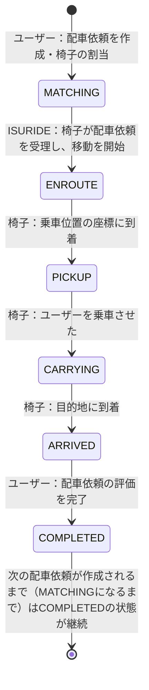

# ISURIDE アプリケーションマニュアル

<!-- TODO（公開前）: リンクの張り替え -->
[ISUCON14 当日マニュアル](./manual.md)も合わせて確認してください。

## ISURIDEとは
「電車での移動は大変…」「自家用車は駐車場代が高い…」そんなあなたにおすすめな全く新しいライドチェアサービスがISURIDEです。

ISURIDEはアプリで呼んだ椅子に座り、自動運転で目的地まで移動できるサービスです。
昨今、持続可能な社会を目指すためシェアリングへコノミーへの注目が高まっています。
また、自動運転という新たなビジネスモデルは交通事故の削減や、交通渋滞の緩和なども期待されています。

ISURIDEでは、チェアオーナーが提供する椅子をユーザーがアプリから配車リクエスト、目的地を入力しマッチングするとすぐに椅子が到着します。

利用後のドライビング評価システムを活用し、ユーザー・チェアオーナーともに満足度の高いライドチェアサービスを実現していきます。

利用エリアも続々拡大中！
オトクな招待キャンペーンも実施中！
今なら新規登録でますますお得に！

## 用語
### 地域（region）
- ISURIDEがサービスされている架空の世界に存在する地域（チェアタウン・コシカケシティ）です。
- 地域およびその郊外を含めて、碁盤の目のように区画され道が整備されています。

### 距離（distance）と座標（coordinate）
- ISURIDEの地図上での距離は、マンハッタン距離（直線距離ではなく、縦横の差の合計）で計算されます。
- 地図における座標は `latitude` と `longitude` で表されます。

### ユーザー（user）
- ISURIDEアプリを利用して実際に移動する人です。
- ユーザーは在住している地域内での移動を目的としてISURIDEを利用します。

### 椅子（chair）
- ユーザーを載せて移動する自律運転式の椅子です。
- 椅子はISURIDEアプリを通じてユーザーに配車されます。
- 椅子には移動速度の異なるモデルが複数存在します。ユーザーの待機時間や全体としての流動性を考慮して割り当てを行うことが望ましいです。
- 椅子は自律運転で移動しますが、必ずしも最短の経路で移動するわけではありません。
- 椅子は正しく位置履歴を記録するため、位置情報を更新するリクエストが成功したことを確認するまで次の移動を行いません。

### オーナー（owner）
- ISURIDEで椅子を運用している企業・個人です。
- 椅子を運用することで収益を上げることを目的としています。
- オーナーは定期的に自分の管理している椅子の収益を確認し、十分に収益を上げられていることを確認すると更なる椅子の導入を検討します。

### 配車依頼（ride）
- ユーザーがISURIDEアプリを通じて椅子を呼び出し、椅子に乗り移動後、評価を行うまでの一連の流れのことを指します。
- ユーザーは自分が行った配車依頼が　`COMPLETED` になるまで他の配車依頼を行うことができません。
- 椅子は自分に割り当てられた配車依頼が `COMPLETED` になるまで他の配車依頼を受けることができません。
- `COMPLETED` に遷移する際、ユーザーはそのrideに対して評価を行います。
  - この評価はユーザーの口コミに影響を与えるため、高い評価はユーザー数の増加に繋がります。
  - 評価には以下のような項目が関係していることが知られています。
    - 配車を依頼してから実際に椅子が割り当てられるまでの時間
    - 割り当てられた椅子が乗車位置に早く到着しそうかどうか（乗車位置に近い椅子が割り当てられていたり、遠くても速い椅子が割り当てられている場合が好ましい）
    - 椅子が割り当てられてから、ユーザーが乗車できるまでの時間
    - ユーザーが乗車してから目的地に到着するまでの時間

配車依頼は、 `MATCHING`, `ENROUTE`, `PICKUP`, `CARRYING`, `ARRIVED`, `COMPLETED` の6つの状態を持ちます。

それぞれの状態は以下のように遷移します。



## 通知エンドポイント
ISURIDEではクライアントに配車状態の変化を通知するための2つのエンドポイントが実装されています。
- ユーザー向け通知： `/api/app/notification`
- 椅子向け通知： `/api/chair/notification`

これらはリファレンス実装では通常のJSONレスポンスを返すエンドポイントですが、[SSE(Server-Sent Events)](https://developer.mozilla.org/ja/docs/Web/API/Server-sent_events/Using_server-sent_events)を利用してリアルタイム通知を実装することも可能です。
どちらの実装においても、状態変更から3秒以内に通知されていることが期待されます。

### JSONレスポンス
- サーバーがJSONレスポンスを返す場合、クライアントはポーリングによって配車状態の変化を取得します。
- Content-Typeは `application/json` です。
- クライアントはレスポンスの `retry_after_ms` で指定された時間後に再度リクエストを送信します。
  - リファレンス実装では30ms後に再度リクエストを送信するようになっています。

### SSE(Server-Sent Events)
- サーバーがSSEを利用してリアルタイム通知を行う場合、クライアントはSSEストリームから配車状態の変化を取得します。
- Content-Typeは `text/event-stream` です。
- 通知メッセージは `data: ` に続けて、webappディレクトリに存在するopenapi.yamlの `components.schemas.UserNotificationData` または `components.schemas.ChairNotificationData` のJSON文字列を返します。
  - これはJSONレスポンスの `data` に相当します。
  - 通知メッセージは1行で記述し、最後に改行を入れる必要があります。
  - 実際のレスポンス例は以下を参照してください。
- サーバーは接続後即座にその時送信するべき最新の配車状態を送信しなければなりません
- その後は随時最新の配車状態を送信します。
  - 状態が変わった時のみ即座に送信することが望ましいです。

以下はSSEでの通知レスポンスの例です。

#### ユーザー向け通知
```
data: {"ride_id":"01JEG4X2TZSE169T99XERS990M","pickup_coordinate":{"latitude":0,"longitude":0},"destination_coordinate":{"latitude":20,"longitude":20},"fare":1500,"status":"ENROUTE","chair":{"id":"01JDFEF7MGXXCJKW1MNJXPA77A","name":"QC-L13-8361","model":"クエストチェア Lite","stats":{"total_rides_count":1,"total_evaluation_avg":5}},"created_at":1733561322336,"updated_at":1733561322690}

data: {"ride_id":"01JEG4X2TZSE169T99XERS990M","pickup_coordinate":{"latitude":0,"longitude":0},"destination_coordinate":{"latitude":20,"longitude":20},"fare":1500,"status":"PICKUP","chair":{"id":"01JDFEF7MGXXCJKW1MNJXPA77A","name":"QC-L13-8361","model":"クエストチェア Lite","stats":{"total_rides_count":1,"total_evaluation_avg":5}},"created_at":1733561322336,"updated_at":1733561322690}

data: {"ride_id":"01JEG4X2TZSE169T99XERS990M","pickup_coordinate":{"latitude":0,"longitude":0},"destination_coordinate":{"latitude":20,"longitude":20},"fare":1500,"status":"CARRYING","chair":{"id":"01JDFEF7MGXXCJKW1MNJXPA77A","name":"QC-L13-8361","model":"クエストチェア Lite","stats":{"total_rides_count":1,"total_evaluation_avg":5}},"created_at":1733561322336,"updated_at":1733561322690}

data: {"ride_id":"01JEG4X2TZSE169T99XERS990M","pickup_coordinate":{"latitude":0,"longitude":0},"destination_coordinate":{"latitude":20,"longitude":20},"fare":1500,"status":"CARRYING","chair":{"id":"01JDFEF7MGXXCJKW1MNJXPA77A","name":"QC-L13-8361","model":"クエストチェア Lite","stats":{"total_rides_count":1,"total_evaluation_avg":5}},"created_at":1733561322336,"updated_at":1733561322690}

data: {"ride_id":"01JEG4X2TZSE169T99XERS990M","pickup_coordinate":{"latitude":0,"longitude":0},"destination_coordinate":{"latitude":20,"longitude":20},"fare":1500,"status":"CARRYING","chair":{"id":"01JDFEF7MGXXCJKW1MNJXPA77A","name":"QC-L13-8361","model":"クエストチェア Lite","stats":{"total_rides_count":1,"total_evaluation_avg":5}},"created_at":1733561322336,"updated_at":1733561322690}

data: {"ride_id":"01JEG4X2TZSE169T99XERS990M","pickup_coordinate":{"latitude":0,"longitude":0},"destination_coordinate":{"latitude":20,"longitude":20},"fare":1500,"status":"CARRYING","chair":{"id":"01JDFEF7MGXXCJKW1MNJXPA77A","name":"QC-L13-8361","model":"クエストチェア Lite","stats":{"total_rides_count":1,"total_evaluation_avg":5}},"created_at":1733561322336,"updated_at":1733561322690}

data: {"ride_id":"01JEG4X2TZSE169T99XERS990M","pickup_coordinate":{"latitude":0,"longitude":0},"destination_coordinate":{"latitude":20,"longitude":20},"fare":1500,"status":"ARRIVED","chair":{"id":"01JDFEF7MGXXCJKW1MNJXPA77A","name":"QC-L13-8361","model":"クエストチェア Lite","stats":{"total_rides_count":1,"total_evaluation_avg":5}},"created_at":1733561322336,"updated_at":1733561322690}

data: {"ride_id":"01JEG4X2TZSE169T99XERS990M","pickup_coordinate":{"latitude":0,"longitude":0},"destination_coordinate":{"latitude":20,"longitude":20},"fare":1500,"status":"COMPLETED","chair":{"id":"01JDFEF7MGXXCJKW1MNJXPA77A","name":"QC-L13-8361","model":"クエストチェア Lite","stats":{"total_rides_count":2,"total_evaluation_avg":4.5}},"created_at":1733561322336,"updated_at":1733561370916}

data: {"ride_id":"01JEG4X2TZSE169T99XERS990M","pickup_coordinate":{"latitude":0,"longitude":0},"destination_coordinate":{"latitude":20,"longitude":20},"fare":1500,"status":"COMPLETED","chair":{"id":"01JDFEF7MGXXCJKW1MNJXPA77A","name":"QC-L13-8361","model":"クエストチェア Lite","stats":{"total_rides_count":2,"total_evaluation_avg":4.5}},"created_at":1733561322336,"updated_at":1733561370916}

data: {"ride_id":"01JEG4X2TZSE169T99XERS990M","pickup_coordinate":{"latitude":0,"longitude":0},"destination_coordinate":{"latitude":20,"longitude":20},"fare":1500,"status":"COMPLETED","chair":{"id":"01JDFEF7MGXXCJKW1MNJXPA77A","name":"QC-L13-8361","model":"クエストチェア Lite","stats":{"total_rides_count":2,"total_evaluation_avg":4.5}},"created_at":1733561322336,"updated_at":1733561370916}

data: {"ride_id":"01JEG4X2TZSE169T99XERS990M","pickup_coordinate":{"latitude":0,"longitude":0},"destination_coordinate":{"latitude":20,"longitude":20},"fare":1500,"status":"COMPLETED","chair":{"id":"01JDFEF7MGXXCJKW1MNJXPA77A","name":"QC-L13-8361","model":"クエストチェア Lite","stats":{"total_rides_count":2,"total_evaluation_avg":4.5}},"created_at":1733561322336,"updated_at":1733561370916}

```

#### 椅子向け通知
```plaintext
data: {"ride_id":"01JEG4X2TZSE169T99XERS990M","user":{"id":"01JEG4W4E1QF0ZA1YY4BYGA1M5","name":"CON ISU"},"pickup_coordinate":{"latitude":0,"longitude":0},"destination_coordinate":{"latitude":20,"longitude":20},"status":"MATCHING"}

data: {"ride_id":"01JEG4X2TZSE169T99XERS990M","user":{"id":"01JEG4W4E1QF0ZA1YY4BYGA1M5","name":"CON ISU"},"pickup_coordinate":{"latitude":0,"longitude":0},"destination_coordinate":{"latitude":20,"longitude":20},"status":"ENROUTE"}

data: {"ride_id":"01JEG4X2TZSE169T99XERS990M","user":{"id":"01JEG4W4E1QF0ZA1YY4BYGA1M5","name":"CON ISU"},"pickup_coordinate":{"latitude":0,"longitude":0},"destination_coordinate":{"latitude":20,"longitude":20},"status":"PICKUP"}

data: {"ride_id":"01JEG4X2TZSE169T99XERS990M","user":{"id":"01JEG4W4E1QF0ZA1YY4BYGA1M5","name":"CON ISU"},"pickup_coordinate":{"latitude":0,"longitude":0},"destination_coordinate":{"latitude":20,"longitude":20},"status":"CARRYING"}

data: {"ride_id":"01JEG4X2TZSE169T99XERS990M","user":{"id":"01JEG4W4E1QF0ZA1YY4BYGA1M5","name":"CON ISU"},"pickup_coordinate":{"latitude":0,"longitude":0},"destination_coordinate":{"latitude":20,"longitude":20},"status":"ARRIVED"}

data: {"ride_id":"01JEG4X2TZSE169T99XERS990M","user":{"id":"01JEG4W4E1QF0ZA1YY4BYGA1M5","name":"CON ISU"},"pickup_coordinate":{"latitude":0,"longitude":0},"destination_coordinate":{"latitude":20,"longitude":20},"status":"COMPLETED"}
```

### 通知の順序
どちらの通知もクライアントに対しては発生したすべての状態遷移を発生した順序通りに少なくとも1回以上（at least once）返す必要があります。

例えばユーザーが配車依頼Aを作成し椅子が割り当てられ椅子が乗車位置に到着したあと初めて通知エンドポイントにリクエストした場合を考えます。
この時、配車依頼Aは`MATCHING` → `ENROUTE` → `PICKUP` の順で状態が遷移しているため、クライアントには下記順序で通知を返す必要があります。
- 1回目：配車依頼A:`MATCHING`
- 2回目：配車依頼A:`ENROUTE`
- 3回目：配車依頼A:`PICKUP`

同様に配車依頼Aで目的地に到着し、評価を行った後に配車依頼Bを作成したあと通知エンドポイントにリクエストした場合、クライアントには下記順序で通知を返す必要があります。
- 1回目：配車依頼A:`ARRIVED`
- 2回目：配車依頼A:`COMPLETED`
- 3回目：配車依頼B:`MATCHING`
- 4回目：配車依頼B:`ENROUTE`

## 配車依頼のマッチング
リファレンス実装では `isuride-matcher` というsystemdサービスが `GET /api/internal/matching` を500msごとにポーリングすることで配車依頼と椅子のマッチングを行っています。
以下の手順でマッチング間隔を変更することができます。

1. `/home/isucon/env.sh` を編集し、`ISUCON_MATCHING_INTERVAL` の値を変更します。
2. `sudo systemctl restart isuride-matcher.service` でサービスを再起動します。

## 決済マイクロサービス
ISURIDEを利用して目的地に到着した際、ユーザーは椅子の利用料金を支払う必要があります。
この支払い処理は社内の決済マイクロサービスを使用していますが、現在そのインフラが不安定なためリクエストが集中すると決済処理の途中でサーバーからのレスポンスが失われる可能性があります。
そのためリファレンス実装ではリクエストが失敗した場合は支払履歴を確認し、支払処理が完了していないことを確認した場合にはリクエストをリトライする実装となっています。
ただし既に支払い処理が開始されている場合、後述する`Idempotency-Key`ヘッダを使用せずにリトライを行うと、複数回の支払いが発生しエラーとなります。
<!-- TODO: APIについては /path/to/openapi.yaml を参照する旨を記載 -->

### Idempotency-Key ヘッダを利用したリクエストの重複防止
決済マイクロサービスでは、`Idempotency-Key`ヘッダを利用して決済の重複を防ぐことができます。
リクエストヘッダに`Idempotency-Key`というキーで、リクエストを一意に識別するための値を指定することで、同じ`Idempotency-Key`ヘッダを持つリクエストが複数回送信されたとしても冪等に処理されます。

### 決済マイクロサービスモックについて
ISURIDEの開発に利用できる決済マイクロサービスのモックとして、選手に提供される各サーバーのポート12345番でHTTPサーバーが起動しています。
このモックサーバーは以下の制約を持っています。

- 決済トークンはどんなものでも受け入れる
- 決済処理は常に成功する

決済マイクロサービスモックを停止または再起動する場合は以下のコマンドを利用してください。

```sh
sudo systemctl stop isuride-payment_mock.service
sudo systemctl restart isuride-payment_mock.service
```

なお、負荷走行後に決済マイクロサービスモックを利用する際は、下記のように `POST /api/initialize` で決済サーバーエンドポイントを再設定してください。

```sh
curl -H 'content-type: application/json' https://isuride.xiv.isucon.net/api/initialize -d '{"payment_server": "http://localhost:12345"}'
```
