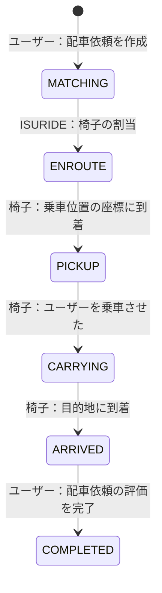

# ISURIDE アプリケーションマニュアル

<!-- TODO（公開前）: リンクの張り替え -->

[ISUCON14 当日マニュアル](./manual.md)も合わせて確認してください。

## ISURIDE とは

「電車での移動は大変…」「自家用車は駐車場代が高い…」そんなあなたにおすすめな全く新しいライドチェアサービスが ISURIDE です。

ISURIDE はアプリで呼んだ椅子に座り、自動運転で目的地まで移動できるサービスです。
昨今、持続可能な社会を目指すためシェアリングへコノミーへの注目が高まっています。
また、自動運転という新たなビジネスモデルは交通事故の削減や、交通渋滞の緩和なども期待されています。

ISURIDE では、チェアオーナーが提供する椅子をユーザーがアプリから配車リクエスト、目的地を入力しマッチングするとすぐに椅子が到着します。

利用後のドライビング評価システムを活用し、ユーザー・チェアオーナーともに満足度の高いライドチェアサービスを実現していきます。

利用エリアも続々拡大中！
オトクな招待キャンペーンも実施中！
今なら新規登録でますますお得に！

## 用語

### 地域（region）

- ISURIDE がサービスされている架空の世界に存在する地域（チェアタウン・コシカケシティ）です。
- 地域およびその郊外を含めて、碁盤の目のように区画され道が整備されています。

### ユーザー（user）

- ISURIDE アプリを利用して実際に移動する人です。
- ユーザーは在住している地域内での移動を目的として ISURIDE を利用します。

<!-- TODO: ユーザーの評価とユーザー数増加についてヒントになりそうなことを書く -->

### 椅子（chair）

- ユーザーを載せて移動する自律運転式の椅子です。
- 椅子は ISURIDE アプリを通じてユーザーに配車されます。
- 椅子はいくつかのモデルがあり、それぞれ移動速度が異なります。
- 椅子は自律運転で移動しますが、必ずしも最短の経路で移動するわけではありません。

### オーナー（owner）

- ISURIDE で椅子を運用している企業・個人です。
- 椅子を運用することで収益を上げることを目的としています。
- オーナーは定期的に自分の管理している椅子の収益を確認し、十分に収益を上げられていることを確認すると更なる椅子の導入を検討します。

### 配車依頼（ride）

- ユーザーが ISURIDE アプリを通じて椅子を呼び出し、椅子に乗り移動後、評価を行うまでの一連の流れのことを指します。
- ユーザーは自分が行った配車依頼が　`COMPLETED` になるまで他の配車依頼を行うことができません。
- 椅子は自分に割り当てられた配車依頼が `COMPLETED` になるまで他の配車依頼を受けることができません。

配車依頼は、 `MATCHING`, `ENROUTE`, `PICKUP`, `CARRYING`, `ARRIVED`, `COMPLETED` の 6 つの状態を持ちます。

それぞれの状態は以下のように遷移します。

## 通知エンドポイント

ISURIDE ではクライアントに配車状態の変化を通知するための 2 つのエンドポイントが実装されています。

- ユーザー向け通知：　`/api/app/notification`
- 椅子向け通知：　`/api/chair/notification`

これらは参考実装では通常の JSON レスポンスを返すエンドポイントですが、SSE(Server-Sent Events)を利用してリアルタイム通知を実装することも可能です。

### JSON レスポンス

- サーバーが JSON レスポンスを返す場合、クライアントはポーリングによって配車状態の変化を取得します。
- Content-Type は `application/json` です。
- クライアントはレスポンスの `retry_after_ms` で指定された時間後に再度リクエストを送信します。
  - 未指定の場合は 30ms 後に再度リクエストを送信します。

### SSE(Server-Sent Events)

- サーバーが SSE を利用してリアルタイム通知を行う場合、クライアントは SSE ストリームから配車状態の変化を取得します。
- Content-Type は `text/event-stream` です。
- 通知メッセージは以下のようになります。
  - `data: {JSONデータ}`
- サーバーは接続後即座に接続してきたユーザーまたは椅子に割り当てられた最新の配車状態を送信する必要があります。
- その後は随時最新の配車状態を送信します。
  - 状態が変わった時のみ即座に送信することが望ましいです。

<!-- TODO: 実際のレスポンスを例示する　-->

###

- アプリ向けと椅子向けの通知がある
- 通常はポーリングによる通知になっている
  - retry_after_ms でリトライ間隔を指定できる
- 以下の仕様を満たすような SSE を実装することも可能
- :w
